

  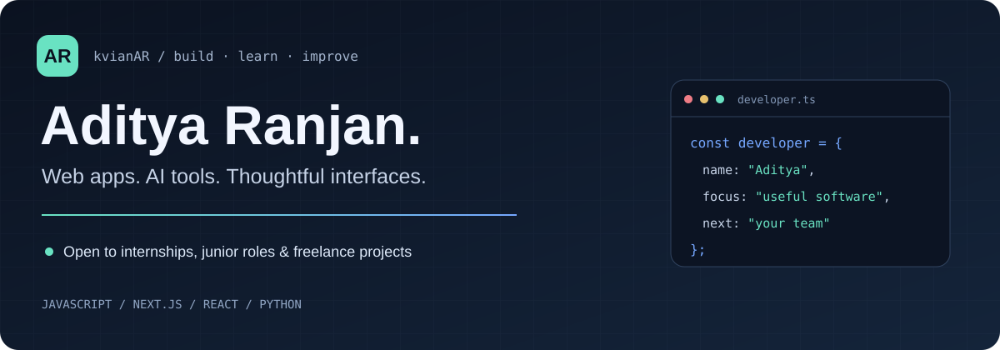

  <a href="https://www.linkedin.com/in/aditya-ranjan-37a827323/">LinkedIn</a> ·
  <a href="https://kvianar.github.io/Capstone/">Portfolio</a> ·
  <a href="#selected-projects">Selected projects</a> ·
  <a href="https://github.com/kvianAR?tab=repositories">All repositories</a>

  
  
  

## Hey, I'm Aditya 👋

I build full-stack web applications and explore practical uses of AI. My projects span an AI study companion, a step-tracking app, and a portfolio built with HTML and CSS. I enjoy turning an idea into a usable interface, connecting it to an API, and improving the details that make it easier to use.

**Open to developer internships and junior developer roles**, with an interest in freelance web projects and collaboration. Reach me on [LinkedIn](https://www.linkedin.com/in/aditya-ranjan-37a827323/).

## 🚀 Selected projects

| Project | What it does | Technologies | Explore |
| :--- | :--- | :--- | :--- |
| **[MindMate](https://github.com/kvianAR/mindmate)** | Organizes study notes, generates summaries and flashcards with Gemini, and tracks study sessions. | Next.js · React · PostgreSQL · Prisma · Gemini | [Code & setup](https://github.com/kvianAR/mindmate#readme) |
| **[StepSync](https://github.com/kvianAR/Step-Tracker-)** | Logs daily steps and sleep, displays activity charts, and includes a sample-data demo. | Next.js · React · MongoDB · Recharts | [Code & setup](https://github.com/kvianAR/Step-Tracker-#readme) |
| **[Developer portfolio](https://github.com/kvianAR/Capstone)** | A responsive project showcase with accessible navigation and direct project links. | HTML · CSS | [Visit portfolio](https://kvianar.github.io/Capstone/) |
| **[Employee attrition analytics](https://github.com/kvianAR/SectionB_G12_Employee_Attrition)** | Team HR analytics project exploring attrition, compensation and employee experience using dashboard reports. | Data cleaning · Pivot tables · Dashboard analysis | [Team project](https://github.com/kvianAR/SectionB_G12_Employee_Attrition#readme) |

The employee attrition repository is a **fork of [oksaumya/Employee_Attrition_Analysis](https://github.com/oksaumya/Employee_Attrition_Analysis)**. Credit belongs to the original project and Section B Group 12 team; the repository is not presented as solo work.

## 🧰 Tech Stack

<strong>The tools behind my projects</strong> Web development, data and practical AI workflows.

<h3 align="center">Languages &amp; foundations</h3>
<table align="center"><tr><td align="center" width="145"> <b>JavaScript</b></td><td align="center" width="145">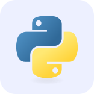 <b>Python</b></td><td align="center" width="145"> <b>HTML5</b></td><td align="center" width="145">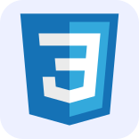 <b>CSS3</b></td></tr></table>

<h3 align="center">Frontend</h3>
<table align="center"><tr><td align="center" width="145"> <b>React</b></td><td align="center" width="145">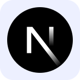 <b>Next.js</b></td><td align="center" width="145">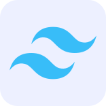 <b>Tailwind CSS</b></td></tr></table>

<h3 align="center">Backend &amp; data</h3>
<table align="center"><tr><td align="center" width="145">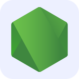 <b>Node.js</b></td><td align="center" width="145">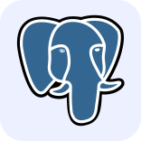 <b>PostgreSQL</b></td><td align="center" width="145">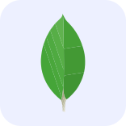 <b>MongoDB</b></td><td align="center" width="145">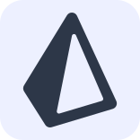 <b>Prisma</b></td></tr></table>

<h3 align="center">Tools &amp; collaboration</h3>
<table align="center"><tr><td align="center" width="145">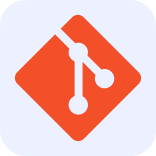 <b>Git</b></td><td align="center" width="145"> <b>GitHub</b></td></tr></table>

Also used in my repositories: Gemini API · Mongoose · Recharts · ESLint · GitHub Actions

## 📊 GitHub Snapshot

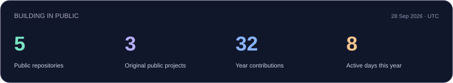

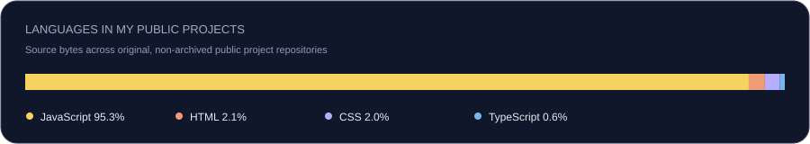

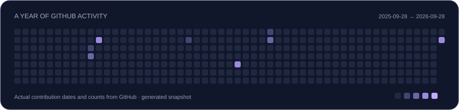

Actual GitHub API data; snapshot date is shown on the cards. Language percentages describe repository source bytes, not proficiency. Refresh with the repository's “Refresh profile visuals” workflow.

## What I'm focusing on

- Building useful web apps with clear interfaces and documented setup.
- Improving authentication, input validation and how real data reaches the UI.
- Making projects easier to review through screenshots, tests and automated checks.
- Exploring AI features that support everyday workflows.

<strong>Working together</strong>

I'm interested in opportunities where I can contribute to frontend or full-stack development and continue learning with a team. For freelance collaboration, I am especially interested in portfolio sites, responsive interfaces and web application features.

You can find the source, setup instructions and project limitations in each repository. For a role, internship or project conversation, [connect with me on LinkedIn](https://www.linkedin.com/in/aditya-ranjan-37a827323/).

---

Build something useful. Make it clear. Keep improving.

